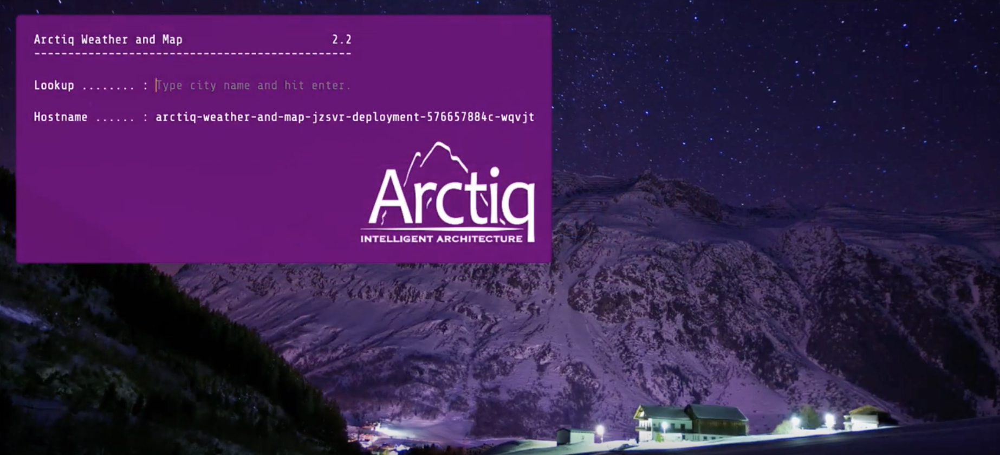

# Arctiq Weather App
Simple Node.js Command Line Weather Application

* Built upon bmorielli25's [weather-app](https://github.com/bmorelli25/simple-nodejs-weather-app)

This repo was used to build an app and promote across different OpenShift clusters in this [demo](https://www.arctiq.ca/our-blog/2018/10/6/multi-cloud-application-container-deployment-pipeline/) and in this [demo](https://www.arctiq.ca/events/2019/6/27/navigating-anthos-a-focus-on-hybrid-cloud-visibility/)

## Usage

This repo is separated by branches:

```
$ git branch -a
* master
  remotes/origin/HEAD -> origin/master
  remotes/origin/dynamic
  remotes/origin/master
  remotes/origin/static
```

## Static branch

The OG weather app:

OpenShift sample usage:

```
$ oc new-app https:/github.com/arctiqteam/weather-app#static
```


## Dynamic branch

The new slick weather app with dynamic background images and maps



## Offline branch

This is for using in airgapped environments. The weather app is not really functional with this.

### Have an idea for another branch? Submit a PR!
